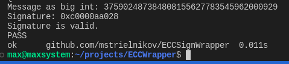

# ECCWrapper

Wrppaer library which simplifies operations over basic ECC algebra incapsulating `crypto/elliptic` package

# Testing

Run tests for the module 
```bash
go test
```

# Demo


_______


